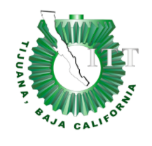

# Analisis avanzado de software :computer:

# :page_facing_up: Información #

**Nombre Del alumno:** Valerde Sanchez Alejandro

**Número de control:** 17212935.

**Carrera:** Ingeniería en Tecnologias de la información y comunicaciones.
**Nombre Del equipo:** Ethereal Arts

**Nombre del maestro:** Mtro Jaime Leonardo Enriquez Alvarez.

**Materia:** Análisis avanzado de software

# :open_file_folder: Índice #

# :notebook: Unidad 1

**:file_folder: Trabajo individual**
* [C0.1 Integrar equipos de trabajo](https://github.com/valerdesh/analisis_avanzado_software/blob/main/blogs/C0.1_IntegrarEquiposDeTrabajo_AlejandroValerdeSanchez.md)
*  [C0.2 Tipo de sistema de información](https://github.com/valerdesh/analisis_avanzado_software/blob/main/blogs/C0.2_TipoDeSistemaInformacion_ValerdeSanchezAlejandro.md)
*  [C0.3 Diagrama de flujo del proceso](https://github.com/valerdesh/analisis_avanzado_software/blob/main/blogs/C0.3_DiagramaDeFlujoSobreProcesoDeDesarrollo_ValerdeSanchezAlejandro.md)

**:file_folder: Trabajo en equipo**
* [A0.1 Recopilación de datos por medio de la entrevista](https://github.com/valerdesh/analisis_avanzado_software/blob/main/blogs/A0.1_Recopilacion_de_datos_de_por_medio_de_la_entrevista.md)

**:clipboard: Trabajo individual PDF**
* [C0.1 Integrar equipos de trabajo](https://github.com/valerdesh/analisis_avanzado_software/blob/main/pdf/C0.1_IntegrarEquiposDeTrabajo_AlejandroValerdeSanchez.pdf)
*  [C0.2 Tipo de sistema de información](https://github.com/valerdesh/analisis_avanzado_software/blob/main/pdf/C0.2_TipoDeSistemaInformacion_ValerdeSanchezAlejandro.pdf)
*  [C0.3 Diagrama de flujo del proceso](https://github.com/valerdesh/analisis_avanzado_software/blob/main/pdf/C0.3_DiagramaDeFlujoSobreProcesoDeDesarrollo_ValerdeSanchezAlejandro.pdf)

**:clipboard: Trabajo en equipo PDF**
* [A0.1 Recopilación de datos por medio de la entrevista](https://github.com/valerdesh/analisis_avanzado_software/blob/main/pdf/A0.1_Recopilacion_de_datos_de_por_medio_de_la_entrevista_ValerdeSanchezAlejandro.pdf)

# :blue_book: Unidad 2

**:file_folder:Trabajo individual**
* [C1.1 Definición de Objetivo general y los especificos, asi como el modelado del negocio.](https://github.com/valerdesh/analisis_avanzado_software/blob/main/blogs/C1.1_Definicio%CC%81nDeObjetivoGeneralYLosEspecificosAsiComoElModeladoDelNegocio_ValerdeSanchezAlejandro.md)

* [C1.2 Elaboracion del acta constitutiva del proyecto.](https://github.com/valerdesh/analisis_avanzado_software/blob/main/blogs/C1.2_Acta_Constitutiva_del_proyecto_Valerde_Sanchez_Alejandro.md)

* [C1.3 Requisitos del sistema para el caso de estudio.](https://github.com/valerdesh/analisis_avanzado_software/blob/main/blogs/C1.3%20Requisitos%20del%20sistema%20para%20el%20caso%20de%20estudio.md)

* [C1.4 Modelado de requisitos a través de diagramas de comportamiento.](https://github.com/valerdesh/analisis_avanzado_software/blob/main/blogs/C1.4%20Modelado%20de%20requisitos%20a%20trav%C3%A9s%20de%20diagramas%20de%20comportamiento.md)

* [C1.5  Modelado de requisitos a través de diagramas estructurados](https://github.com/valerdesh/analisis_avanzado_software/blob/main/blogs/C1.5_Modelado_de_requisitos_a_trav%C3%A9s_de_diagramas_estructurados_ValerdeSanchezAlejandro.md)
  
**:file_folder: Trabajo en equipo**

* [A1.0 Consolidacion del acta constitutiva](https://github.com/valerdesh/analisis_avanzado_software/blob/main/blogs/A1.0%20Consolidacion%20del%20acta%20constitutiva.md)

**:clipboard: Trabajo individual PDF**

* [C1.1 Definición de Objetivo general y los especificos, asi como el modelado del negocio.](https://github.com/valerdesh/analisis_avanzado_software/blob/main/pdf/C1.1_Definicio%CC%81nDeObjetivoGeneralYLosEspecificosAsiComoElModeladoDelNegocio_ValerdeSanchezAlejandro.pdf)

* [C1.2 Elaboracion del acta constitutiva del proyecto.](https://github.com/valerdesh/analisis_avanzado_software/blob/main/pdf/C1.2_Acta_Constitutiva_del_proyecto_Valerde_Sanchez_Alejandro.pdf)

* [C1.3 Requisitos del sistema para el caso de estudio.](https://github.com/valerdesh/analisis_avanzado_software/blob/main/pdf/C1.3%20Requisitos%20del%20sistema%20para%20el%20caso%20de%20estudio.pdf)

* [C1.4 Modelado de requisitos a través de diagramas de comportamiento.](https://github.com/valerdesh/analisis_avanzado_software/blob/main/pdf/C1.4%20Modelado%20de%20requisitos%20a%20trave%CC%81s%20de%20diagramas%20de%20comportamiento%20-%20Valerde%20Sa%CC%81nchez%20Alejandro%3B.pdf)

* [C1.5  Modelado de requisitos a través de diagramas estructurados](https://github.com/valerdesh/analisis_avanzado_software/blob/main/pdf/C1.5_Modelado_de_requisitos_a_trav%C3%A9s_de_diagramas_estructurados_ValerdeSanchezAlejandro.pdf)

  
**:clipboard: Trabajo en equipo PDF**

* [A1.0 Consolidacion del acta constitutiva](https://github.com/valerdesh/analisis_avanzado_software/blob/main/pdf/A1.0%20Consolidacion%20del%20acta%20constitutiva.pdf)
